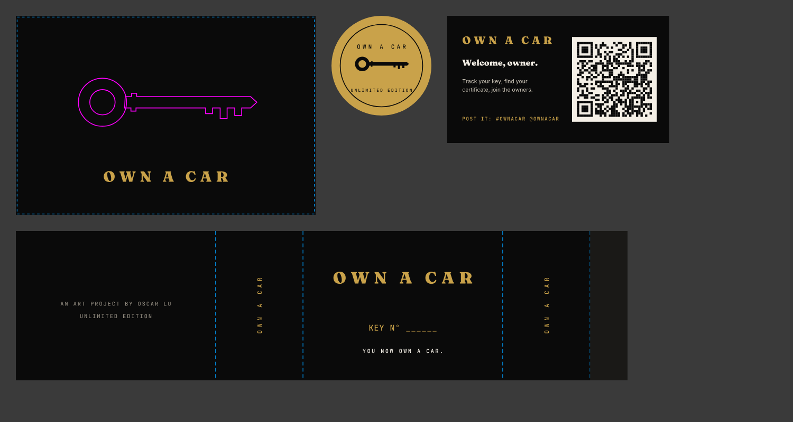

# Packaging

It should feel like picking up keys at a dealership: heavy, black, quiet, one flash of brass.

## Print files (real size, all text outlined, `python3 own-a-car/tools/packaging.py` rebuilds them)

| File | Size | Stock | Finish |
|---|---|---|---|
| `box-lid.svg` | 120 × 80 mm lid top | Rigid 2 mm greyboard wrapped in black soft-touch paper | Key **blind deboss** (magenta), wordmark **gold foil** |
| `sleeve.svg` | 245 × 60 mm flat | 350 gsm uncoated black | Gold foil; key number hand-written in gold paint pen *or* digitally printed per unit |
| `seal.svg` | 40 mm round | Gold foil sticker paper | Black print; seals the tissue |
| `insert-card.svg` | 89 × 51 mm | 600 gsm black board | Digital print + gold foil wordmark; QR → key page |
| `certificate.html` | 5 × 7 in | 350 gsm cotton, bone | Printed per owner by `ops.py certificates`; the seal and rules can be foiled on a pre-run |

Color conventions: `#c9a24a` = foil, `#ff00ff` = deboss (not printed), `#00a0ff` = trim and folds (not printed).

## The unboxing, in order
1. **Mailer:** plain black corrugated (170 × 120 × 60 mm) with black tape carrying a small gold `OWN A CAR`. Nothing outside says what's inside.
2. **Tissue:** black, sealed with the gold `seal.svg` sticker.
3. **Sleeve:** slides off the box. `KEY Nº ____` on the front.
4. **Rigid box, lid and base:** 120 × 80 × 35 mm. The lid should drop slowly. Specify a **tight tolerance fit** (≤0.5 mm).
5. **Inside the lid:** foil-printed *"You now own a car."* (add to the lid dieline once the vendor sends it).
6. **Insert:** black velvet-flocked EVA foam, CNC-cut to the key.
7. **The key.**
8. **Under the insert:** the certificate and the insert card.

## The key: spec for foundry quotes
- **Design:** the ring-bow house-key shape of `assets/key.jpg` (not the skeleton key in `box.jpg`). Overall ~85 mm long, ring OD 32 mm, 5 mm thick.
- **Source:** 3D-scan the car's real key blade profile once the car is bought, so every key is "cast from the real one". Until then, samples use the drawn key.
- **Material:** solid brass (C360) lost-wax cast or CNC, brushed finish, clear lacquer to slow tarnish. ~70 g.
  Cheaper fallback: zinc die-cast with brass plating (~60 g), which says "brass-plated" on the site.
- **Engraving:** fiber-laser, `Nº 0042` on the ring face, JetBrains Mono. Numbers come from `ops.py export`.
- **Non-functional:** no transponder, no chip. The blade profile is decorative and must not be cut to the car's real code.

## Rough unit cost at 5,000 units
| Part | Cost |
|---|---|
| Brass key, cast + brushed + lacquered + laser-numbered | $5–9 (zinc: $2.5–4) |
| Rigid box + flocked insert | $2.5–4.5 |
| Sleeve (foil) | $0.5–1 |
| Certificate (cotton, digital) + insert card | $0.6–1.2 |
| Seal, tissue, mailer, tape | $1–1.8 |
| **Total** | **≈ $10–17** (the model uses $13) |

## Vendors to quote (at least two each; always pay for samples)
- **Rigid boxes:** Arka, PakFactory, Packlane (US); rigid-box makers on Alibaba (cheapest; order samples, check the soft-touch quality)
- **Keys:** custom brass-casting shops (search "lost wax brass casting custom keychain"), challenge-coin and keychain makers
  (Alibaba, Etsy manufacturers), or a US jewelry caster for the premium route
- **Certificates:** a local letterpress shop for the foil pre-run, and digital printing per name
- **Stickers and tape:** Sticker Mule (foil stickers, custom tape)

## Quote request (paste into vendor emails)
> Hi, I'm quoting packaging for an art project shipping 5,000–15,000 units in March 2027.
> Rigid two-piece box (lid + base), 120 × 80 × 35 mm outer, 2 mm board, black soft-touch wrap, blind deboss on lid (~60 × 20 mm),
> one gold hot-foil (~50 × 5 mm) on lid and one inside the lid, tight lid fit, black flocked EVA insert with one custom cutout (~85 × 32 mm).
> Please quote unit prices at 5k / 10k / 15k, sample cost and lead time, and send your dieline. Artwork is ready as vector.
